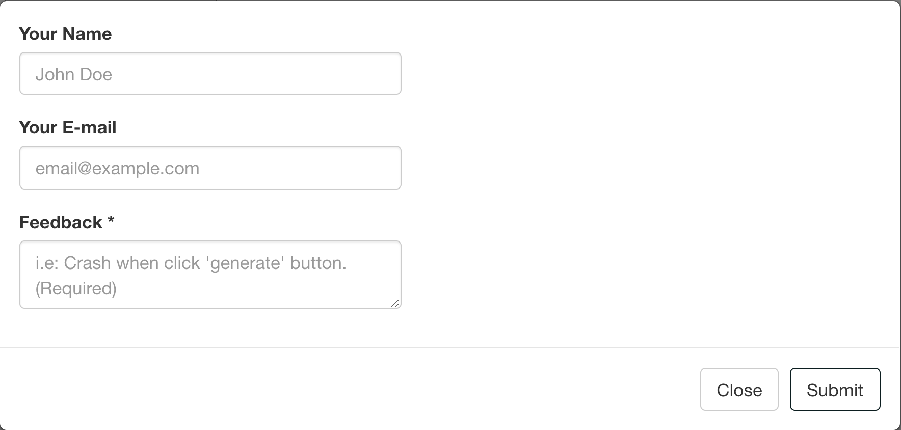

# emailjsr

[emailjs.com](https://www.emailjs.com/) support for R.

## Install

    ## From github: latest version
    remotes::install_github('changwoolim/emailjsr')

## Before Use

Before use, you should sign up at [emailjs.com](https://www.emailjs.com/), and make your template. Please sure that you should not expose your user id, access token, and so on.

### Allow non-Browser Applications

You should allow EmailJS API for non-browser applications.

## User-agent, Browser width and height

If you want to detect User-agent, Browser width and height, type down `shinybrowser::detect()` on your ui.

## Use with your own application

    emailjsr::send_email(service_id, user_id, template_id, template_params, access_token)

## Using Preset modal

When you use '[shiny](https://shiny.rstudio.com)', you can use preset modal.

    library(shiny)
    library(emailjsr)

    ui <- fluidPage(
      use_emailjsr_ui("id")
    )

    server <- function(input, output, session) {
      emailjsr::use_emailjsr_server("id",
        service_id = "Your_service_id",
        template_id = "Your_template_id",
        user_id = "Your_user_id",
        access_token = "Your_Access_Token",
        language = "en"
      )
    }

    shinyApp(ui, server)

Please remember you should fill your own ids, and tokens.

You can see button named "Show feedback modal". This message is default, and you can change it. When you click, you will see modal below.

In this preset, Feedback \* is required. So if you don't write down anything, error message will be shown. If you fill Feedback \* and other form(if needed), just click "Submit" button. You will receive email right away.

## Feedback

You can make issue at [my github repository](https://github.com/ChangwooLim/emailjsr/issues). Any bug report, suggestion are welcomed.
